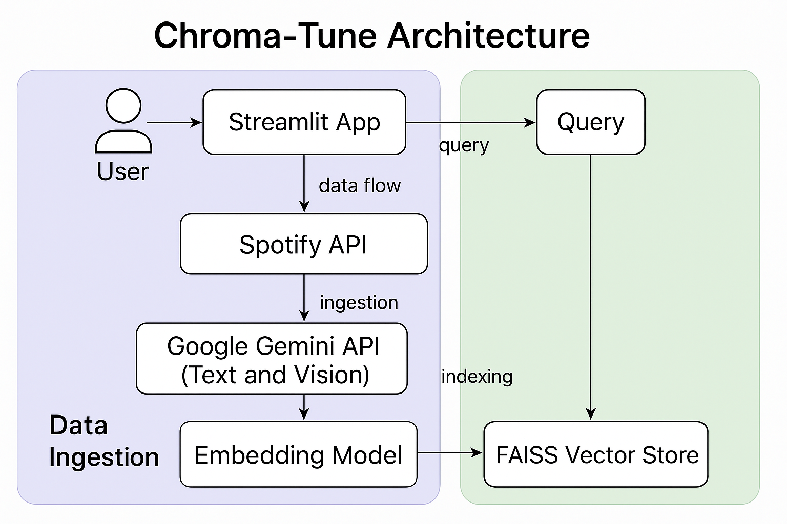

# Chroma-Tune: AI-Powered Music Discovery

Struggling to find the perfect soundtrack for the moment? Chroma-Tune is a modern, full-stack AI application that curates song recommendations based on your exact "vibe."

Simply upload an image or describe a scene, and our multi-modal AI searches your personal library to find the perfect music match.


---

## Overview

This application uses a multi-modal AI approach to understand the "vibe" of an image or text description and then searches through a Spotify playlist to find songs with a similar mood. It's a powerful demonstration of Retrieval-Augmented Generation (RAG) that you can run entirely on your own machine.

### Core Technologies
- **Frontend:** Next.js 14 (React), Tailwind CSS, Shadcn UI, Framer Motion
- **Backend:** FastAPI (Python)
- **Orchestration Framework:** LangChain
- **AI & Vision Models:** Google Gemini 2.5 Flash
- **Vector Database:** Pinecone (Serverless Cloud Index)
- **Music Data:** Spotify Web API
- **Infrastructure:** Docker & Docker Compose


---

## Features

- **Image-to-Music:** Upload a photo or use your camera, and the AI will analyze the scene's mood, color, and ambiance to recommend songs.
- **Text-to-Music:** Provide a text description of a setting (e.g., "a rainy day, perfect for studying") to get matching music.
- **Dynamic Playlist Analysis:** Connect any Spotify playlist. The app fetches the songs, uses an LLM to generate a rich "vibe" description for each track, and builds a searchable in-memory vector database.

---

## How to Run Locally

### Prerequisites

Before you begin, make sure you have the following:
1. **Docker Desktop** installed and running.
2. API Keys for:
   - **Google AI Studio (Gemini API)**
   - **Spotify Developer Dashboard (Client ID & Secret)**
   - **Pinecone (Serverless Index API Key)**

### Setup Instructions

1. **Clone the repository:**
    ```bash
    git clone https://github.com/KS-Mohit/Chroma-Tune.git
    cd Chroma-Tune
    ```

2. **Create your environment variables:**
    - Create a `.env` file in the project root.
    - Add your actual API keys:
      ```bash
      # .env
      GOOGLE_API_KEY="your_google_key"
      SPOTIFY_CLIENT_ID="your_spotify_client_id"
      SPOTIFY_CLIENT_SECRET="your_spotify_client_secret"
      PINECONE_API_KEY="your_pinecone_key"
      ```

3. **Run the app using Docker Compose:**
    ```bash
    docker-compose up --build
    ```

4. **Access the App:**
    Open your browser and go to:
    ```
    http://localhost:3000
    ```

---

## Architecture Flow

### 1. Ingestion (Adding to Library)
- User enters a Spotify Playlist ID into the Next.js frontend.
- FastAPI backend retrieves track metadata from Spotify.
- Google Gemini generates immersive one-sentence descriptions for batches of 10 songs.
- Descriptions are embedded using `text-embedding-004` (768-dim vectors).
- Vectors are upserted into **Pinecone** with deduplication using Spotify IDs.
- Playlist metadata is stored locally in `playlists.json`.

### 2. Querying (The Vibe Check)
- User uploads an image or types a description.
- Gemini Vision interprets the scene and returns a descriptive text.
- The description is embedded into a vector.
- Pinecone performs cosine similarity search.
- Matching songs are returned to the frontend with similarity scores and Spotify links.

---
